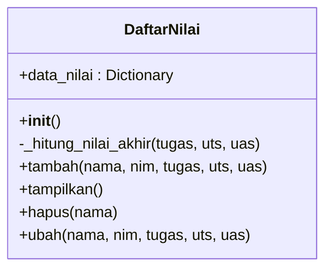

## Diagram Class

Berikut adalah **Penjelasan Program** yang disusun rapi, siap untuk Anda salin ke dalam file `README.md` pada bagian penjelasan.

---

### Penjelasan Program

Program ini disusun menggunakan konsep **Pemrograman Berorientasi Objek (OOP)** untuk mensimulasikan sistem pengelolaan data nilai mahasiswa. Seluruh logika dan penyimpanan data dibungkus (encapsulation) ke dalam sebuah *class* bernama `DaftarNilai`.

Berikut adalah rincian cara kerja program:

#### 1. Struktur Data
Program tidak menggunakan database eksternal, melainkan menggunakan **Dictionary** (`self.data_nilai`) sebagai tempat penyimpanan sementara.
* **Key**: Menggunakan `Nama Mahasiswa` sebagai kunci unik agar mudah dicari.
* **Value**: Berupa *dictionary* bersarang yang berisi `NIM`, `Nilai Tugas`, `Nilai UTS`, `Nilai UAS`, dan `Nilai Akhir`.

#### 2. Fungsionalitas (Method)
Class `DaftarNilai` memiliki metode-metode berikut untuk menangani operasi CRUD:

* **`__init__(self)`**
    Metode inisialisasi yang dijalankan saat objek dibuat. Bertugas menyiapkan *dictionary* kosong untuk menampung data.

* **`tambah(self, nama, nim, ...)`**
    Berfungsi untuk menginput data baru. Sebelum data disimpan, metode ini akan memanggil fungsi internal untuk menghitung **Nilai Akhir** secara otomatis. Data kemudian disimpan ke dalam *dictionary* dengan nama sebagai kuncinya.

* **`tampilkan(self)`**
    Berfungsi untuk mencetak seluruh data yang ada di dalam *dictionary*. Data diformat sedemikian rupa agar tampil rapi dalam bentuk tabel, mencakup Nama, NIM, dan seluruh komponen nilai. Jika data kosong, program akan memberikan notifikasi.

* **`hapus(self, nama)`**
    Menghapus data mahasiswa berdasarkan nama yang diinputkan. Program akan mengecek apakah nama tersebut ada di dalam daftar; jika ada, data dihapus menggunakan perintah `del`.

* **`ubah(self, nama, ...)`**
    Fitur ini memungkinkan perubahan data (NIM atau Nilai) pada mahasiswa yang sudah terdaftar. Keunggulan metode ini adalah:
    * Mencari data berdasarkan nama.
    * Hanya mengubah data yang diminta (data yang tidak diisi akan tetap sama).
    * Jika ada perubahan pada nilai (Tugas/UTS/UAS), maka **Nilai Akhir** akan dihitung ulang secara otomatis agar data tetap akurat.

* **`_hitung_nilai_akhir(self, ...)`**
    Ini adalah metode bantuan (*helper method*) yang bersifat privat. Digunakan untuk menghitung nilai akhir berdasarkan bobot:
    * Nilai Tugas: 30%
    * Nilai UTS: 35%
    * Nilai UAS: 35%

#### 3. Alur Eksekusi
Pada blok `main`, program membuat *instance* dari class `DaftarNilai`, lalu mendemonstrasikan penambahan 3 data mahasiswa (Elika, Fransisca, Dian), menampilkan data tersebut, melakukan perubahan nilai pada salah satu mahasiswa, menghapus data mahasiswa lain, dan menampilkan hasil akhirnya untuk memverifikasi bahwa semua fungsi berjalan dengan baik.
